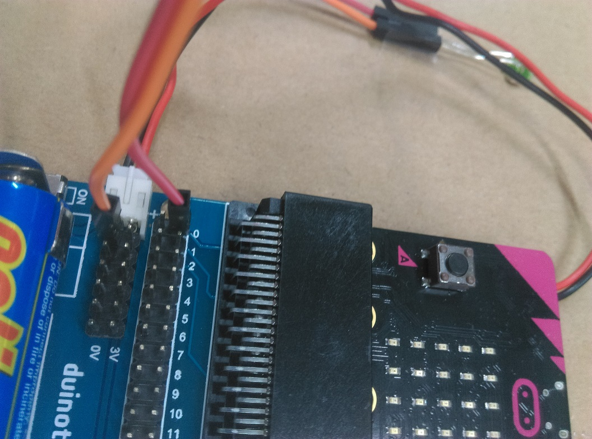

# Microbit Christmas

Combine a micro:bit [XC4320](https://jaycar.com.au/p/XC4320) and breakout board [XC4330](https://jaycar.com.au/p/XC4330) to create an electronic christmas tree using up to 12 LEDs and your own imagination. Decorate the tree any way you like and make the LEDs dance around on your creation. Battery operated and no soldering required.

Requires 2xAA batteries (not included)

## Table of Contents

- [Microbit Christmas](#Microbit-Christmas)
  - [Table of Contents](#Table-of-Contents)
  - [Bill of Materials](#Bill-of-Materials)
    - [You will also need](#You-will-also-need)
  - [Assembly](#Assembly)
    - [Making the card](#Making-the-card)
  - [Programming](#Programming)
    - [Turning an LED on and off](#Turning-an-LED-on-and-off)
  - [Uploading the code](#Uploading-the-code)
  - [Troubleshooting](#Troubleshooting)
  - [Finished](#Finished)

## Bill of Materials

| Qty | Part                                     | Description                   |
| --- | ---------------------------------------- | ----------------------------- |
| 1   | [XC4320](https://jaycar.com.au/p/XC4320) | Micro:bit                     |
| 1   | [XC4330](https://jaycar.com.au/p/XC4330) | Breakout board for micro:bit  |
| 3   | [ZD0185](https://jaycar.com.au/p/ZD0185) | Blue LED                      |
| 2   | [ZD0170](https://jaycar.com.au/p/ZD0170) | Green LED                     |
| 3   | [ZD0160](https://jaycar.com.au/p/ZD0160) | Yellow LED                    |
| 1   | [WC6026](https://jaycar.com.au/p/WC6026) | Socket to socket jumper leads |
| 1   | [SB2424](https://jaycar.com.au/p/SB2424) | Double pack of AA batteries   |

### You will also need

- Some scissors
- A small knife
- Glue stick
- Firm thick cardboard
- Sticky tape

## Assembly

First step is to put the micro:bit into the breakout board as shown.

You must make sure the batteries are facing the same direction as the picture under the battery holder. Connect the power lead from the board up to the power connector on the micro:bit and turn the breakout board on. You should see the micro:bit come to life.

If you look closely at the breakout board, you will see each of the pins are labelled as shown:

The pins are labelled from `0 -> 16`, which is what we will connect one lead of the LED to, then we will plug the other lead to one of either `0v` or `3v`

### Making the card

Find a nice picture online that you want to light up with LED lights. Here we used a picture of a tree from google images, but you can use anything. You will also need a small piece of firm cardboard, from a small box or similar, to poke the LEDs into.

cut out this image and stick it to the cardboard so that the surface and well glued to the cardboard.

Now is where we will use the knife to cut a small hole to push the LEDs through. **Get an adult to help you.**

Start by making a small `x` shape where you want the LED to go. being gentle and slow is key here so that you do not make the hole too big, about the size of the LED is the correct size.

Once the `x` marks the spot, it is generally better to first push the LED in through the front of the face, so that the cardboard curls towards the back of the card, such as shown:

When viewed from the back, we can see the cardboard has bent through, which shows on the back of the board, rather than the front.

Once the LED is in this way, twist and slide it out, and you should find that the cardboard will retain it's shape and maintain a nice clean hole for you to slide the LED in through the proper way.

Likewise, the cardboard cut-outs are now behind the face, not getting in the way of the picture.

From here, you can simply bend the LED leads down to lay flat on the board. Pull off 2 wires from your jumper leads ([WC6026](https://jaycar.com.au/p/WC6026)) to slide onto the legs of the LED, remembering which leg is longer than the other.

LEDs need to be connected in the right way; The longer leg is the `positive` connection for the LED, which will turn on when there is voltage.

Below, we have connected the positive to `Pin0` and the negative to `0v`.

You can do this for the first 6 LEDs. When you want to connect more LEDs but do not have any `0v` connections available, you will be able to connect the **positive** to the `3v` connection and the negative to any of the pins.

(We will explain how to turn these on in the programming section below.)

## Programming

Head on over to <https://makecode.microbit.org/#editor> to start writing code.

When you start up the editor you should be taken to a blank project page where you are able to put command blocks. This is what the editor should look like:

The command block that we want is under `Advanced > Pins` - you can use this to turn the individual pins on and off. Drag the block `digital write pin P0 to 0` onto the editing panel.

Also drag a `Basic > pause` block onto the panel, and change it to `500 (ms)`

Click to highlight a block with a yellow boarder, then press `Control+c` to copy and `Control+v` to paste the block, you should now have two blocks that seem identical, do this for both the `digital write` and the `pause` blocks so you have 4 blocks in total, and arrange them as such:

Notice as well that we have set the second `digital write` block to a value of 1, where the other remains at a value of 0.

You should be able to see a little animation of the pins. When you change the delay, you can see how fast that will turn the `pin0` on and off. Play around with setting them to different values and see if the result is what you expect.

Copy and paste the blocks to set each pin high and low in whatever pattern you like, making sure to change the pin number according to which LED you have connected to that number on the breakout board.

### Turning an LED on and off

With LEDS that are connected between the `Pin (+)` and `0v (-)` connections, setting a `digital write` of **1** will turn the LED `ON`.

Likewise, if you have an LED connected between `3v (+)` and `Pin (-)` connection, setting a `digital write` of **0** will turn the LED `ON`. We will let you play around with it and find out why.

## Uploading the code

Once you have finished your code and want to see it in action, connect the micro:bit to the computer using a micro-usb cable.

Press download on the micro:bit online editor and it will download a new file for you with a `.hex` extension. This should be in your downloads folder and could be called something such as `microbit-Untitled.hex`

You should see the micro:bit show up on your computer as if it was a thumb-drive. It won't have much information in it at the moment.

drag the file from your downloads folder into the micro:bit drive. the window should close and re-open, meaning that your micro:bit has been reset and is now using your code.

If you have done everything correctly, your LED lights should be flashing merrily as you programmed them to.

## Troubleshooting

- If the LEDs are not lighting up, make sure the breakout board is turned on and that all of the connections are secure.
- If the Lights are on without flashing, make sure you have 2 delays set to about the same value so that there is equal amount of "turn off" time as there is "turn on" time. If it turns off for 1ms, you will not be able to tell that it turned off at all. Make sure the animation on the make-code editor looks right to you.

## Finished

Congratulations, you have created your own micro:bit christmas card. Try to add the buttons so that the buttons can change the pattern of the LEDs.
